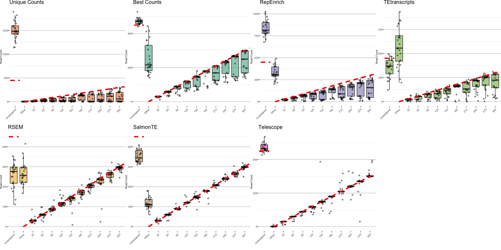
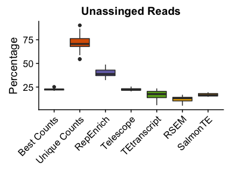
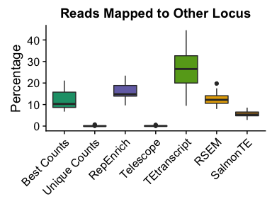
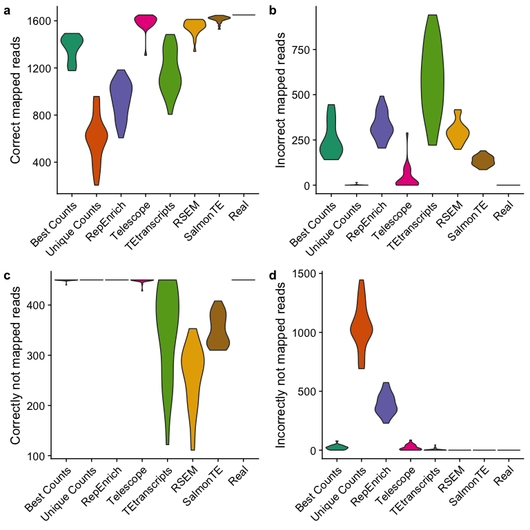
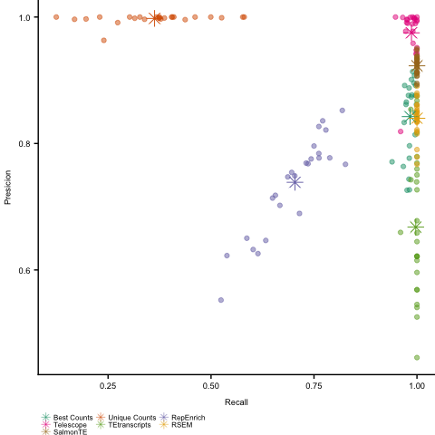
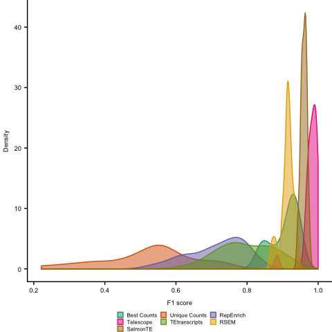
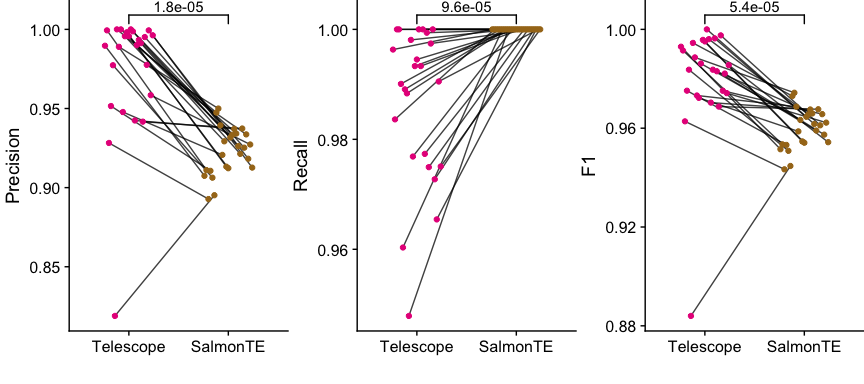
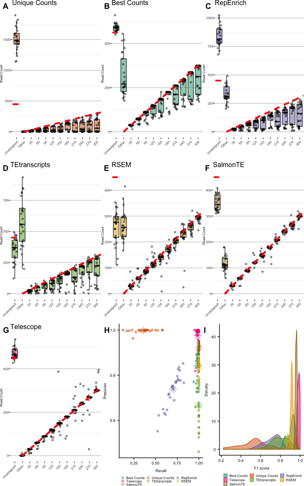

Images
================
Luis P Iniguez
4/15/2019

First all counts need to be together in a file:

``` bash
head -n 1 HML2_SIM_1/table.txt > allSim_numbers.txt
awk 'FNR>1' HML2_SIM_*/table.txt >> allSim_numbers.txt
```

``` r
if (!requireNamespace("BiocManager", quietly = TRUE)) install.packages("BiocManager")
if (!requireNamespace("ggplot2", quietly = TRUE,warn.conflicts=F)) BiocManager::install("ggplot2", version = "3.8")
if (!requireNamespace("cowplot", quietly = TRUE,warn.conflicts=F)) BiocManager::install("cowplot", version = "3.8")
if (!requireNamespace("RColorBrewer", quietly = TRUE,warn.conflicts=F)) BiocManager::install("RColorBrewer", version = "3.8")
if (!requireNamespace("ggsignif", quietly = TRUE,warn.conflicts=F)) BiocManager::install("ggsignif", version = "3.8")
```

``` r
library(ggplot2)
library(cowplot)
library(ggsignif)
library("RColorBrewer")
library(knitr)


data<-read.table("allSim_numbers.txt", skip=1, col.names = c("locus","best_counts","uni_counts","repenrich_counts","telescope","tetr_counts","RSEM","SalmonTE","real"))
data<-cbind(data,cathegorie=data$real)
data$cathegorie[data$locus=="__no_feature"]<-"Unassigned"
data$cathegorie[data$locus=="Others"]<-"Other"
data$cathegorie<-factor(data$cathegorie,levels=c("Unassigned","Other",as.character(seq(from=30,to=300,by=30))))

colorp<-brewer.pal(n = 7, name = "Dark2")

tem<- theme(  text = element_text(size=10),
              panel.grid.major = element_line(colour = "gray80"),
              panel.border = element_blank(),
              axis.text.x = element_text(angle=45,hjust = 1,lineheight = 0.7,size = 6),
              axis.text.y = element_text(size = 6, margin=margin(l=0)),
              axis.title.y = element_text(size = 6, margin=margin(l=0,r=0)),
              panel.grid.minor.x=element_blank(),
              panel.grid.major.x=element_blank(),
              strip.text.y = element_text(size=7),
              strip.text.x = element_text(size=7),
              plot.margin=margin(l=0,unit="cm", b=0,r=0),
              strip.background = element_rect(colour="white",fill="gray80"),
              legend.position="bottom")

plot_box_sim<-function(data2plot,x2plot,y2plot,title,color2plot,tem2plot=tem,limit){
  res<-ggplot(data=data2plot,mapping= aes_string(y=y2plot,x=x2plot))+
    geom_boxplot(outlier.shape = NA, fill=color2plot, alpha=0.5)+ggtitle(title)+
    geom_jitter(shape=16, position=position_jitter(0.25), colour= "black", alpha=0.5)+
    geom_segment(aes(x=2,y=0,xend=12.5,yend=315),colour=rgb(1,0,0),linetype="dashed",size=1.1)+
    geom_segment(aes(x=0.5,y=limit,xend=1.5,yend=limit),colour=rgb(1,0,0),linetype="dashed",size=1.1)+
    ylab("Read Count")+ xlab("")+theme_bw()+tem2plot
  return(res)
}
```

``` r
pbest<-plot_box_sim(data2plot=data,x2plot="cathegorie",y2plot="best_counts", title="Best Counts",color2plot=colorp[1],limit=data$real[data$locus=="__no_feature"][1])
puniq<-plot_box_sim(data2plot=data,x2plot="cathegorie",y2plot="uni_counts", title="Unique Counts",color2plot=colorp[2],limit=data$real[data$locus=="__no_feature"][1])
pRepEn<-plot_box_sim(data2plot=data,x2plot="cathegorie",y2plot="repenrich_counts", title="RepEnrich",color2plot=colorp[3],limit=data$real[data$locus=="__no_feature"][1])
pTele<-plot_box_sim(data2plot=data,x2plot="cathegorie",y2plot="telescope", title="Telescope",color2plot=colorp[4],limit=data$real[data$locus=="__no_feature"][1])
pTEt<-plot_box_sim(data2plot=data,x2plot="cathegorie",y2plot="tetr_counts", title="TEtranscripts",color2plot=colorp[5],limit=data$real[data$locus=="__no_feature"][1])
pREM<-plot_box_sim(data2plot=data,x2plot="cathegorie",y2plot="RSEM", title="RSEM",color2plot=colorp[6],limit=data$real[data$locus=="__no_feature"][1])
pSalm<-plot_box_sim(data2plot=data,x2plot="cathegorie",y2plot="SalmonTE", title="SalmonTE",color2plot=colorp[7],limit=data$real[data$locus=="__no_feature"][1])

plot_grid(puniq,pbest,pRepEn,pTEt,pREM,pSalm,pTele,  nrow = 2)
```



In terms of percentage, unassinged reads were expected to be

    ## [1] "21.43 %"

Nevertheless, the different algorithms tested show different distributions:

``` r
per_unassigned<-(data[grep(data$locus,pattern = '__no_feature'),2:8]/2100*100)
colnames(per_unassigned)<-c("Best Counts","Unique Counts","RepEnrich","Telescope","TEtranscript","RSEM","SalmonTE")
per_unassigned_plot<-stack(as.data.frame(per_unassigned))
ggplot(data = per_unassigned_plot, aes(x=ind,y=values, fill=ind) )+
  geom_boxplot()+ggtitle("Unassinged Reads")+
  scale_fill_manual(values = colorp)+
  ylab("Percentage")+
  theme(legend.position="none",axis.text.x = element_text(angle=45,hjust = 1,lineheight = 0.7),axis.title.x=element_blank())
```



|               |    Min|  1st Qu|  Median|     Mean|  3rd Qu|    Max|
|---------------|------:|-------:|-------:|--------:|-------:|------:|
| Best Counts   |  20.95|   21.86|   22.48|  22.5160|   22.86|  25.14|
| Unique Counts |  54.38|   67.81|   70.57|  71.4436|   76.24|  90.24|
| RepEnrich     |  32.33|   37.05|   38.76|  40.0608|   42.90|  48.76|
| Telescope     |  20.38|   21.57|   22.14|  22.3956|   23.24|  25.52|
| TEtranscript  |   5.81|   13.76|   17.57|  16.7068|   20.43|  23.52|
| RSEM          |   5.29|   10.33|   13.14|  12.3156|   14.14|  16.81|
| SalmonTE      |  14.76|   15.48|   16.38|  16.6956|   18.14|  19.43|

Another aspect to evaluete are the reads mapped to "Other" HML2 locus, which are loci with 0 read counts. The distribution in terms of percentage of reads mapped to other loci looks like this:

``` r
per_other<-(data[grep(data$locus,pattern = 'Others'),2:8]/2100*100)
colnames(per_other)<-c("Best Counts","Unique Counts","RepEnrich","Telescope","TEtranscript","RSEM","SalmonTE")
per_other_plot<-stack(as.data.frame(per_other))
ggplot(data = per_other_plot, aes(x=ind,y=values, fill=ind) )+
  geom_boxplot()+ggtitle("Reads Mapped to Other Locus")+
  scale_fill_manual(values = colorp)+
  ylab("Percentage")+
  theme(legend.position="none",axis.text.x = element_text(angle=45,hjust = 1,lineheight = 0.7),axis.title.x=element_blank())
```



|               |   Min|  1st Qu|  Median|     Mean|  3rd Qu|    Max|
|---------------|-----:|-------:|-------:|--------:|-------:|------:|
| Best Counts   |  6.71|    8.67|   10.29|  12.1280|   15.76|  21.14|
| Unique Counts |  0.00|    0.00|    0.00|   0.0636|    0.05|   0.71|
| RepEnrich     |  9.62|   13.90|   14.81|  15.6496|   18.86|  23.43|
| Telescope     |  0.00|    0.00|    0.05|   0.0620|    0.05|   0.57|
| TEtranscript  |  9.43|   20.00|   26.52|  27.2600|   32.67|  44.52|
| RSEM          |  7.95|   10.57|   12.19|  12.6436|   14.10|  19.76|
| SalmonTE      |  2.86|    4.76|    5.29|   5.5612|    6.52|   8.57|

All reads can be divided in two categories, depending from where they come from, HML2 reads or non-TE reads. Those reads can then be correctly or incorrectly mapped,depending of the outcome of the counting method, leading to 4 different categories: a) reads map to HML2 correctly (True Positive) b) reads map to HML2 incorrectly (False Positive) c) reads not mapped correctly (True Negative) d) reads not mapped incorrectly (False Negative)

It is worth to mention that all the assumptions were made based on the counted reads and not on the proper mapping, since the majority of the algorithms tested provide only the count and not the mapping file.

``` r
data2est<-data[-grep("__no_feature",data$locus),] #all information to mapped to any HERV
dataNOMA<-data[grep("__no_feature",data$locus),colnames(data)[2:9]] #all information of non-mapped reads

mcor<-matrix(ncol=8, nrow=length(data2est$best_counts)) #map correctly
mincor<-matrix(ncol=8, nrow=length(data2est$best_counts)) #map incorrectly
logunma<-matrix(ncol = 8,nrow = 25) #logical more unmapped than simulated

x<-colnames(data)[-1]

for (i in 1:8){
 logi<-(data2est[,x[i]] <= data2est$real)   #has more or less than real read count
 mcor[logi,i]<-data2est[logi,x[i]]            #those with less, all reads are mapped correctly to the HML2
 mcor[!logi,i]<-data2est$real[!logi]          #those with more, only the real reads are mapped correctly
 mincor[!logi,i]<-data2est[!logi,x[i]]-data2est$real[!logi] #those with more, who many were incorrectly mapped
 mincor[logi,i]<-0                            #those with less, non reads are mapped incorrectly
 logunma[,i]<-as.logical(dataNOMA[,x[i]]>dataNOMA$real) #has more unmapped reads than real?
}

tempseq<-vector()
tempVN<-numeric()

mcorHML2<-matrix(ncol = 8,nrow = 25)    #reads map to HML2 correcty
mapincor<-matrix(ncol = 8,nrow = 25)    #reads map to HML2 incorrecty
unmapnoHML2<-matrix(ncol = 8,nrow = 25) #reads not mapped correctly
unmapHML2<-matrix(ncol = 8,nrow = 25)   #reads not mapped incorrectly 

for (i in 1:25){                              #calculation for each simulation
  tempseq<- seq(from=(i-1)*11+1,to = i*11,by=1)
  mcorHML2[i,]<-colSums(mcor[tempseq,1:8])    #sum of map correctly
  mapincor[i,]<-colSums(mincor[tempseq,1:8])  #sum of map incorrectly
  
  unmapnoHML2[i,logunma[i,]] <- dataNOMA$real[i] #if there are more than real unmapped reads then all real reads from non-TE are correctly assinged = not mapped
  unmapnoHML2[i,!logunma[i,]] <- as.numeric(dataNOMA[i,!logunma[i,]])  #if there are less than real unmapped reads only the data from the counting method is counted 
  unmapHML2[i,logunma[i,]] <- as.numeric(dataNOMA[i,logunma[i,]])-dataNOMA$real[i] #how many are incorrectly mapped outside the annotations
  unmapHML2[i,!logunma[i,]] <- 0 #if unmapped reads are less than real unmapped reads there are no HML2 reads incorrectly assinged to a non-TE or unmapped
} 
```



``` r
presicion_samp<-mcorHML2[,1:7]/(mcorHML2[,1:7]+mapincor[,1:7])
recall_samp<-mcorHML2[,1:7]/(mcorHML2[,1:7]+unmapHML2[,1:7])
F1_score<- stack(as.data.frame(2*presicion_samp*recall_samp/(presicion_samp+recall_samp)))
presicion_samp<- stack(as.data.frame(presicion_samp))
recall_samp<- stack(as.data.frame(recall_samp))
colnames(presicion_samp)<-c("Presicion","Counting")
colnames(recall_samp)<-c("Recall","Counting")
colnames(F1_score)<-c("F1","Counting")

presicion<-stack(as.data.frame(t(colSums(mcorHML2[,1:7])/(colSums(mcorHML2[,1:7])+colSums(mapincor[,1:7])))))
recall<-stack(as.data.frame(t(colSums(mcorHML2[,1:7])/(colSums(mcorHML2[,1:7])+colSums(unmapHML2[,1:7])))))

colnames(presicion)<-c("Presicion","Counting")
colnames(recall)<-c("Recall","Counting")

forplt<-data.frame(Presicion=presicion_samp$Presicion,
                   Recall=recall_samp$Recall,
                   Counting=factor(presicion_samp$Counting))
forplt2<-data.frame(Presicion=presicion$Presicion,
                    Recall=recall$Recall,
                    Counting=factor(presicion$Counting))

pres<-ggplot(data=forplt,aes(x=Recall,y=Presicion, colour=Counting))+
  geom_point(alpha=0.5, size=1.5)+
  scale_color_manual(values=colorp)+
  geom_point(data=forplt2,aes(x=Recall,y=Presicion),shape=8, size=4,show.legend=FALSE)+
  guides(colour=guide_legend(nrow=3, byrow = T ,override.aes = list(size=2, shape=8)))+
  theme(text = element_text(size=7),
        legend.position = "bottom",
        legend.title = element_blank(),
        legend.spacing.y = unit(0.1, 'mm'),
        legend.box.margin=margin(t=-10),
        axis.text.x = element_text(size = 7),
        axis.text.y = element_text(size = 7),
        plot.margin=margin(l=0,unit="cm", b=0,r=0, t=0),
        legend.key.height = unit(0, units = "mm"),
        legend.key.width = unit(0, units = "mm"),
        strip.text.x = element_blank(),
        legend.margin = margin(t=0,r=0,b=0,l=0))
pres
```



``` r
levels(F1_score$Counting)<-c("Best Counts", "Unique Counts", "RepEnrich", "Telescope", "TEtranscripts", "RSEM","SalmonTE")
f1<-ggplot(F1_score, aes(x=F1, color=Counting, fill=Counting))+
  geom_density()+
  scale_color_manual(values=colorp)+
  scale_fill_manual(values=alpha(colorp,0.5))+
  xlab("F1 score")+ ylab("Density")+
  guides(colour=guide_legend(nrow=3, byrow = T, keywidth = 0.5, keyheight = 0.5))+
  theme(text = element_text(size=7),
        legend.position = "bottom",
        legend.justific ="center",
        legend.box.margin=margin(t=-10),
        legend.title = element_blank(),
        strip.text.x = element_blank(),
        axis.text.x = element_text(size = 7),
        axis.text.y = element_text(size = 7),
        legend.spacing.y = unit(0.1, 'mm'),
        plot.margin=margin(l=0,unit="cm", b=0,r=0,t=0),
        legend.margin = margin(t=0,r=0,b=0,l=0))
  
f1
```



The most similar results are Telescope and SalmonTE. Telescope present a higher precision and a F1 score while SalmonTE has a better recall.



Each point represent a simulation and since the same simulation fastq file was used as input for the counting method the samples are paired, represented with a line. Wilcoxon paired test was performed and p-values are shown over the line.

The paper plot:

``` r
paper<-plot_grid(puniq,pbest,pRepEn,pTEt,pREM,pSalm,pTele,pres,f1, labels="AUTO", nrow = 3 )
paper
```


