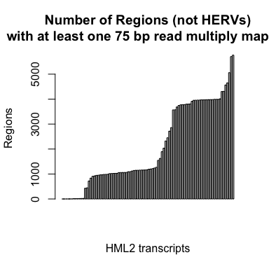
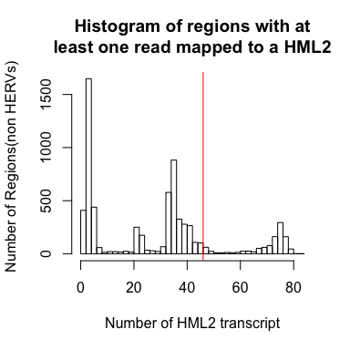
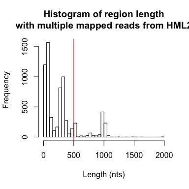
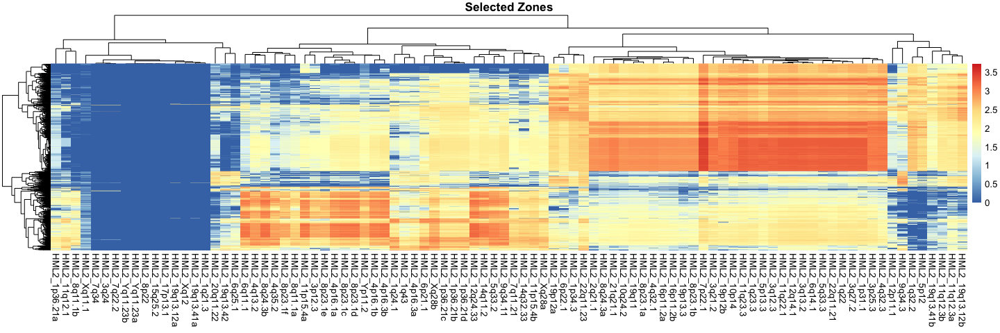

Simulations
================
Luis P Iniguez
4/11/2019

Telescope aligns fragments to the reference genome and implements a Bayesian statistical model for reassigning ambiguous fragments.This approach directly addresses uncertainty in fragment assignment by reassigning ambiguously mapped fragments to the most probable source transcript as determined within a Bayesian statistical model. The source transcript could be part of the annotated segments or other genomic region, not annotated. Reads that originate from non-TE regions were included to test whether methods can correctly identify reads that are not part of the annotated transcriptome and classify them as such.

All possible 75 bp reads from all HML2 loci were exctracted and mapped to the whole genome for the identification of non-TE regions. Bowtie2 was runed with the -a parameter which gives all the possible sites a read can map.

``` bash
#Get fasta transcripts
bedtools getfasta -fi hg38.fa -bed HML2.gtf -fo HML2.fa

#Get all possible reads
perl -e '{open(IN,"$ARGV[0]"); $flag=0;$k=0; 
 while ($l=<IN>){ chomp $l;
  if($l =~ /^>(.+)/){                                         #happens only when a new transcript start
   if ($flag==0){$flag=1; $name=$1;next;                      #only first line
   }else{for ($i=0; $i<(length($seq) - $ARGV[1] +1); $i++){   #sliding window (1bp) readlength equals $ARG[1]
   $temp=substr($seq,$i,$ARGV[1]); print ">$k";print"_$name\n$temp\n";$k++}
    $seq="";$name=$1}
  }else{$seq=$seq.$l;}}                                       #concatene sequence if it has end of line 
 for ($i=0; $i<(length($seq) - $ARGV[1] +1); $i++){
   $temp=substr($seq,$i,$ARGV[1]); print ">$k";print"_$name\n$temp\n";$k++}}' HML2.fa 75 >all_possible_reads_HML2_75.fa

#Map all reads and get all possible mapping sites (-a)
bowtie2 -x /home/ubuntu/references/bowtie2/GCA_000001405.15_GRCh38_no_alt_analysis_set.fna.bowtie_index -U all_possible_reads_HML2_75.fa -S all75reads_mapped_all.sam --very-sensitive -f -a -p $(nproc)
```

Genome coverage was calculated, once all possible mapping sites were identified, form regions outside HERV loci. If a genomic region presents coverage it means that this region present sequence similary to HML2 transcripts.

``` bash
#Get bed file from the annotations
grep -v '#' transcripts.gtf |grep -P '\tgene\t' | cut -f 1,4,5  >transcripts.bed
samtools view -@ $(nproc) -b -h -L transcripts.bed -U nontranscripts_MB_hg38_HML2-75-reads.bam all75reads_mapped_all.sam >/dev/null  #reads mapped to other place than HML2 loci found in the -U

#Sorting the mapped reads
samtools sort -@ $(nproc) nontranscripts_MB_hg38_HML2-75-reads.bam >nontranscripts_MB_hg38_HML2-75-reads_sorted.bam

#Get Genome coverage to find Zones only in primary Chromosomes
bedtools genomecov -bg -ibam nontranscripts_MB_hg38_HML2-75-reads_sorted.bam > regions_covered.bed 
bedtools merge -i regions_covered.bed > regions_merged.bed
bedtools intersect -sorted -wo -a regions_merged.bed -b nontranscripts_MB_hg38_HML2-75-reads_sorted.bam  | awk '{ if ($1 !~ "_")print$0;}' OFS='\t' > intersection_regions_reads.bed
```

Read count for each non-TE region was calculated, a single read could only be mapped once to a non-TE region. Higher read count in the non-TE regions mean a more repetitive region.

``` bash

perl -e '{open(IN,"$ARGV[0]");
while(<IN>){
  @vec=split("\t",$_);if($vec[0]=~/_/){next;}
  $name=$vec[0]."_".$vec[1]."_".$vec[2]."_".$vec[8];
  if(!$all_zones{$name}){$all_zones{$name}++;}                            #identify regions
  if($vec[6] =~ /^\d+_(.+)/){$annotation=$1;                              #annotation is the name of the HML2
    if(!$all_annotations{$annotation}){$all_annotations{$annotation}++;}  #identify all HML2 with repetitive reads
    if(!$done{$name}{$vec[8]}){$h{$name}{$annotation}++;}                 #avoid tandem repeats in the same strand and counts the number of reads per HML2 locus
  }}
foreach $annotation (sort keys %all_annotations){print "\t$annotation";}
foreach $zone(sort keys %all_zones){
  print "\n$zone";
  foreach $annotation (sort keys %all_annotations){
    if(!$h{$zone}{$annotation}){print "\t0";}else{print "\t$h{$zone}{$annotation}";}
  }}
}' intersection_regions_reads.bed >table_nonredundanthits_stranded.txt    #table, colums are HML2 loci and rows are other loci with mapped reads
```

Barplot of regions that have at least one read mapped to each HML2 locus (x-axis)





Non-TE regions with at least one read that mapped to half of the HML2 loci were selected (right of the red line).



Non-TE regions longer than 500 bp were selected.

Heatmap of 75 bp read mapped to region (row) and a HML2 (column), vlaues are log10 transformed.



The selected zones are transformed to gtf.

``` bash
perl -e '{open (IN,$ARGV[0]); while($l=<IN>){ 
  chomp $l; @vec=split("\t",$l);$name=$vec[1]; @vec=split("_",$vec[1]);
  $size=int((($vec[2]-$vec[1])/20)+0.5);
  $fin=$vec[2]+$size; $ini=$vec[1]-$size; #add 5% more of sequence on each side
  if($vec[0] =~/.+/){ 
  print "$vec[0]\tLPI\texon\t$ini\t$fin\t.\t$vec[3]\t.\tgene_id $name ; transcript_id $name ; locus $name\n"; }}}'   regions_with_multiple_mapped_reads_stranded.txt > regions_with_multiple_mapped_reads_stranded_amplified.gtf
```

Taking into account all HML2 and all non-TE regions reads were simulated with this script:

``` r
if (!requireNamespace("BiocManager", quietly = TRUE)) install.packages("BiocManager")
if (!requireNamespace("polyester", quietly = TRUE,warn.conflicts=F)) BiocManager::install("polyester", version = "3.8")
if (!requireNamespace("Biostrings", quietly = TRUE,warn.conflicts=F)) BiocManager::install("Biostrings", version = "3.8")
```

``` bash
echo -e "outdir\tHML2_SIM\nfraglen\t250\nfragsd\t25\nreadlen\t75\nerror_model\tillumina5\nerror_rate\t0.005\npaired\ttrue\nseed\t123556\n" >params_Sim.txt
wget http://hgdownload.cse.ucsc.edu/goldenPath/hg38/bigZips/hg38.chromFa.tar.gz
tar -xvzf hg38.chromFa.tar.gz
rm hg38.chromFa.tar.gz
```

``` r
library("polyester")
library("Biostrings")
param_file<-"params_Sim.txt"
fastas_folder<- "chroms/"
gtf_file<- "HML2.gtf"
gtf_file2<- "regions_with_multiple_mapped_reads_stranded_amplified.gtf"
# Load the parameters
p <- read.table(param_file, sep='\t', stringsAsFactors=F)
params <- lapply(1:nrow(p), function(r) {
  v <- p[r, 2]
  if(grepl(',', v)) {
    vl <- as.integer(unlist(strsplit(v, ',')))
    return(vl)
  }
  suppressWarnings(
    if (is.na(as.numeric(v))) {
      if (is.na(as.logical(v))) {
        ret <- v 
      } else {
        ret <- as.logical(v)
      }
    } else {
      ret <- as.numeric(v)
    }
  )
  ret
})
names(params) <- p$V1


sequen<-seq_gtf(gtf=gtf_file, seqs=fastas_folder)
sequen2<-seq_gtf(gtf=gtf_file2, seqs=fastas_folder)
for (i in 1:25){ #number of simulations
  set.seed(i+params$seed)
  transc<-sample(names(sequen))[1:10]  #10 HML2
  set.seed(i+params$seed)
  transc2<-sample(names(sequen2))[1:3] #3 non-TE
  set.seed(i+params$seed)
  expr<-sample(seq(30,300,by=30)) # Expression of HML2
  expr2<-rep(150,3) # Expression of non-TE regions
  countmat<-data.frame(row.names=c(transc,transc2),expression=c(expr,expr2))
  writeXStringSet(x=c(sequen, sequen2)[rownames(countmat)], filepath="temp_seq4sim.fa")
  outdir_temp<-paste0(params$outdir,"_",i)
  file_count<-paste0(outdir_temp,"/countmat.txt")
  simulate_experiment_countmat(readmat = as.matrix(countmat),fasta="temp_seq4sim.fa",
                               outdir=outdir_temp, fraglen = params$fraglen,
                               fragsd = params$fragsd, readlen = params$readlen,
                               error_model = params$error_model,
                               error_rate = params$error_rate,seed = (i+params$seed))
  write.table(countmat,file=file_count,quote=F,sep="\t")
}
```
